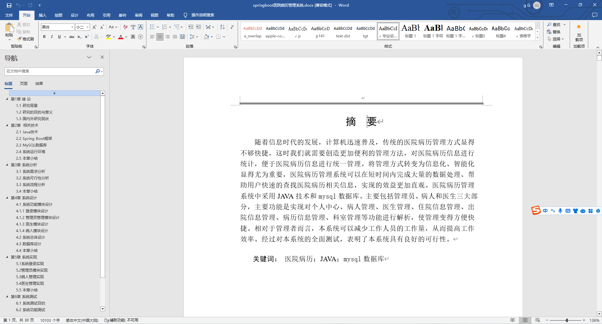
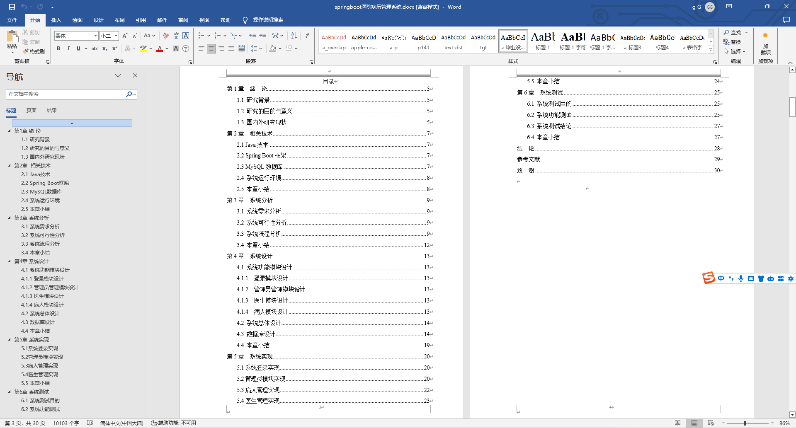
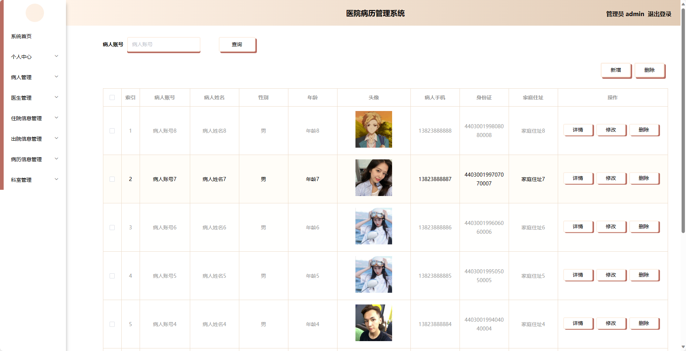
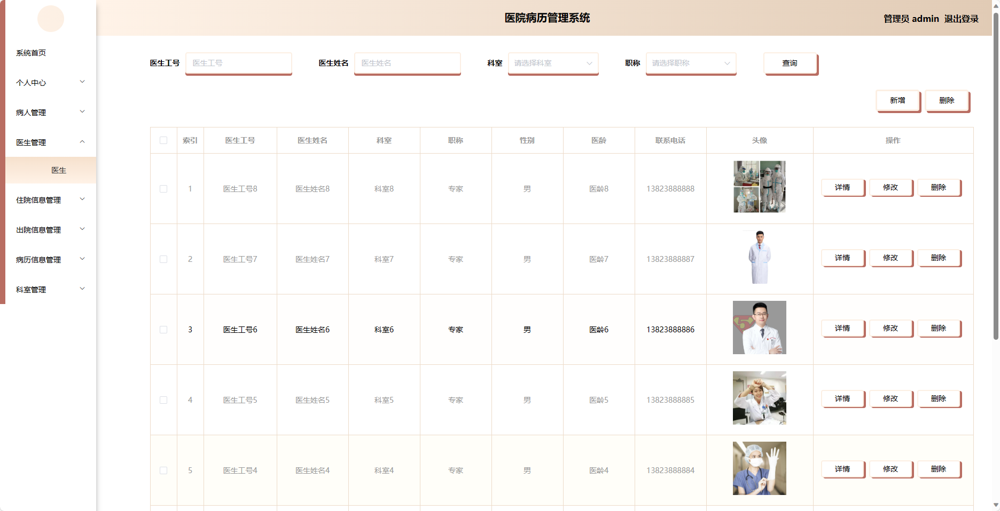
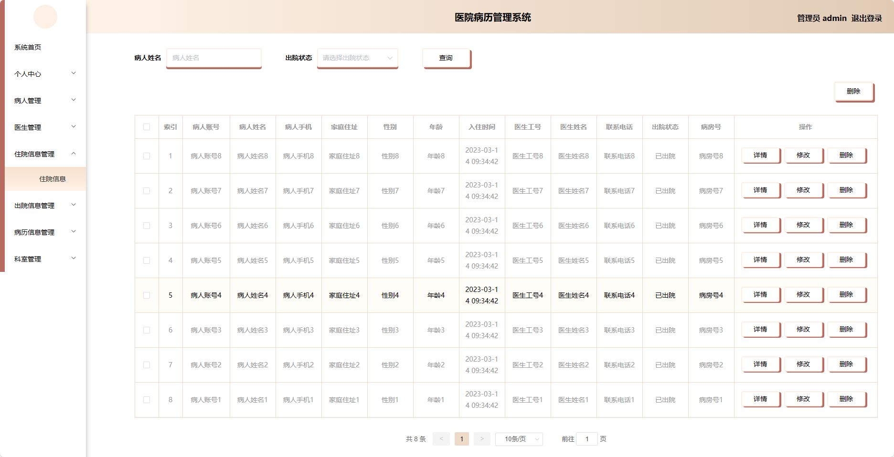
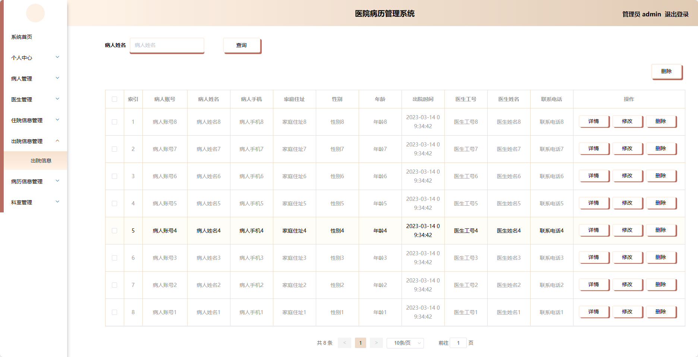
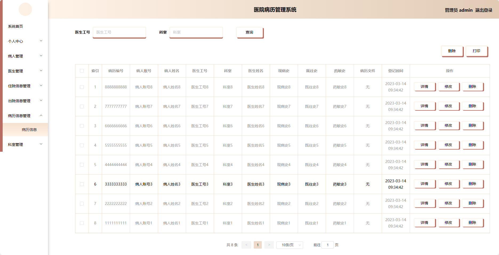
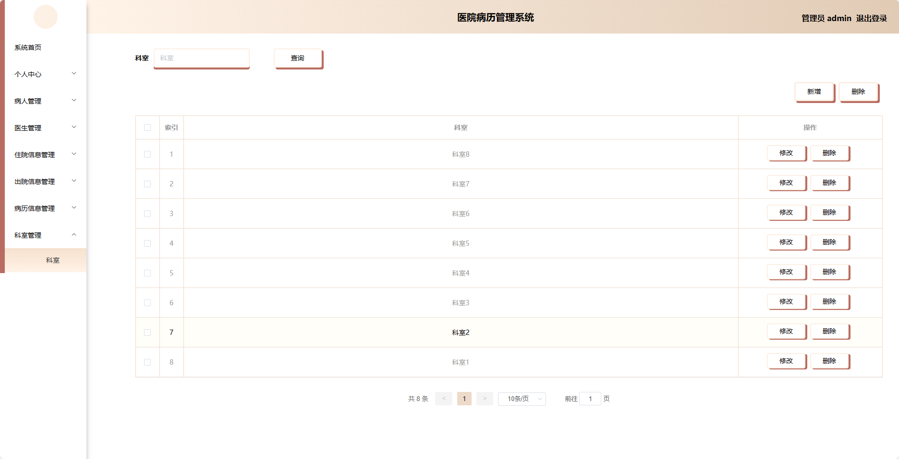
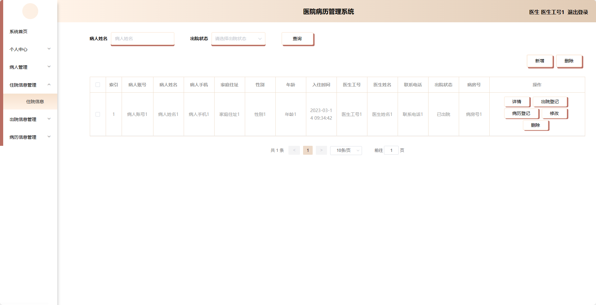
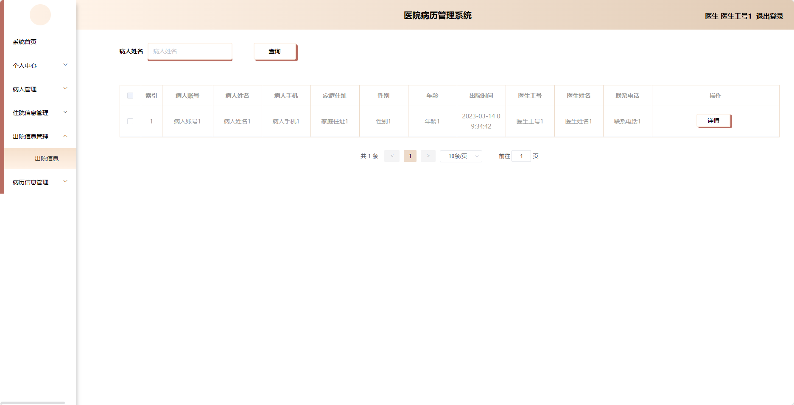

基于SpringBoot的医院病历管理系统（程序+论文）
=
- 完整代码获取地址：从戎源码网 ([https://armycodes.com/](https://armycodes.com/))
- 作者微信：19941326836  QQ：952045282 
- 承接计算机毕业设计、Java毕业设计、Python毕业设计、深度学习、机器学习
- 选题+开题报告+任务书+程序定制+安装调试+论文+答辩ppt 一条龙服务
- 所有选题地址https://github.com/nature924/allProject

一、项目介绍
---
基于Spring Boot框架实现的医院病历管理系统，系统包含两种角色：管理员、医生、病人,主要功能如下。

### 管理员角色：
- 个人中心：管理员可以管理个人信息，修改密码等。
- 病人管理：管理员可以管理病人的信息，包括添加、编辑和删除病人信息。
- 医生管理：管理员可以管理医生的信息，包括添加、编辑和删除医生信息。
- 住院信息管理：管理员可以管理病人的住院信息，包括入院日期、床位分配等。
- 出院信息管理：管理员可以管理病人的出院信息，包括出院日期、离院方式等。
- 病历信息管理：管理员可以管理病人的病历信息，包括病情描述、诊断结果等。
- 科室管理：管理员可以管理医院的科室信息，包括添加、编辑和删除科室信息。

### 医生角色：
- 个人中心：医生可以管理个人信息，修改密码等。
- 病人管理：医生可以管理自己负责的病人信息，包括查看、编辑和删除病人信息。
- 住院信息管理：医生可以管理病人的住院信息，包括入院日期、床位分配等。
- 出院信息管理：医生可以管理病人的出院信息，包括出院日期、离院方式等。
- 病历信息管理：医生可以管理病人的病历信息，包括病情描述、诊断结果等。

### 病人角色：
- 个人中心：病人可以管理个人信息，修改密码等。
- 住院信息管理：病人可以查看自己的住院信息，包括入院日期、床位分配等。
- 出院信息管理：病人可以查看自己的出院信息，包括出院日期、离院方式等。
- 病历信息管理：病人可以查看自己的病历信息，包括病情描述、诊断结果等。

二、项目技术
---
- 编程语言：Java
- 数据库：MySQL
- 项目管理工具：Maven
- 前端技术：VUE、HTML、Jquery、Bootstrap
- 后端技术：Spring、SpringMVC、MyBatis

三、运行环境
---
- 操作系统：Windows、macOS都可以
- JDK版本：JDK1.8以上都可以
- 开发工具：IDEA、Ecplise、Myecplise都可以
- 数据库: MySQL5.7以上都可以
- Tomcat：任意版本都可以
- Maven：任意版本都可以

四、运行截图
---
### 论文截图：

### 程序截图：

